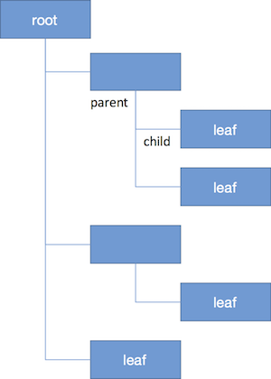

# Module 5: Introduction to HTML

## Overview
**HyperText Markup Language** is a programming language for describing how to display web documents. It uses `<tags>` to **mark up** plain text, and provide rendering instructions to a web-browser or other interpreter such as a screenreader. Even the most beautiful websites and complex data visualizations on the web are simply HTML elements arranged into what people perceive as intriguing sites or innovative charts.


<!-- START doctoc generated TOC please keep comment here to allow auto update -->
<!-- DON'T EDIT THIS SECTION, INSTEAD RE-RUN doctoc TO UPDATE -->
**Contents**

  - [Resources](#resources)
  - [Basic Syntax](#basic-syntax)
    - [Self-Closing Tags](#self-closing-tags)
  - [Document Structure](#document-structure)
    - [Head section](#head-section)
    - [Body Section](#body-section)
- [My Big Page Heading](#my-big-page-heading)
  - [Attributes](#attributes)
    - [Identifying Attributes](#identifying-attributes)
    - [Links](#links)

<!-- END doctoc generated TOC please keep comment here to allow auto update -->

## Resources
There are limitless resources on the web regarding web-programming (shocking), but here are a few to get you started:

- [HTML5 General Reference](http://www.w3schools.com/tags/ref_byfunc.asp)
- [HTML Attribute Reference](http://www.w3schools.com/tags/ref_standardattributes.asp)
- [DOM Intro](http://www.w3schools.com/js/js_htmldom.asp)

## Basic Syntax
As you know, HTML is used to _mark-up_ plain text documents, which helps lend the document structure and provide rendering instructions to a web-browser or other program, such as a screenreader. Each HTML element has a **start tag**, and **end tag**, and typically has **content** in between the two tags (such as some text, or entire **child nodes**). For example, the `<p>` element tells the reader program that the content inside is a normal paragraph, whereas the `<form>` element tells the rendering program that the content inside is a form.

The end tag is just like the start tag except that it has a forward slash added just after the less-than sign (`</p>`). What goes in between the start and end tags is the element's content, which can be plain text and/or other child elements (hence the tree structure). For example, a typical paragraph might have some text and some other elements that also contain their own text:

```html
<p>I want to really <em>emphasize</em> that last point!</p>
```

The `<em>` element is used for content that is emphasized, and it can be nested inside lots of other elements. Although browsers typically render emphasized text in italics, you shouldn't think of that element as "the italics tag." Instead, think of it as a tag that tells the program reading this page that the text inside is emphasized. We can use CSS to format that emphasized text any way we want, so we use the `<em>` element to denote the function that text plays.

### Self-Closing Tags
It's important to be aware of a few tags which _do not_ require a closing tag. These elements only use an opening tag because they _do not_ allow child nodes to be present. For example, the `` tag will not allow you to nest any content inside of it, so it does not require a closing tag:

```html
<p>This is my paragraph which has mulitple elements inside of it.
    
    
</p>
```

You may also see self closing tags written with a forward slash _before_ the greater than symbol, however this is not required:

```html

```

Another commonly used self-closing tag is the `<input>` element, used to gather free-text information in `<form>` tags. See [here](https://www.w3.org/TR/html5/syntax.html#void-elements) for a full list of "void" elements. In the next section, you'll learn how to leverage specific HTML tags to structure your entire document.

## Document Structure
In an HTML document, you'll arrange your `tags` into a tree structure which defines how your page is laid out. Your web-browser will parse the HTML you write and create a visual representation of that information known as the **D**ocument **O**bject **M**odule, or **DOM**. The DOM expresses your content as a series of objects which you will later learn how to manipulate, add, and remove from your page. All HTML files start with a document type declaration, commonly referred to as the "doctype." The HTML version 5 document type declaration is really simple. Enter this as the first line of your HTML file:

```html
<!doctype html>
```

That tells any program that reads this file to interpret the contents as HTML version 5 syntax.

Once you've declared the type of document that you are using, the rest of your content is arranged into a **tree structure**. If you're unfamiliar with a general tree pattern, it takes the following form:



Each of those blue rectangles is known as a **node**. Each node has a **parent node**, except for the one at the top of the tree, which is known as the **root node**. Each node may have one or more **child nodes**, and those children can have children of their own (and so on, and so on). A node with no children is known as a **leaf node**.

The tree structure that you create places elements inside of larger (containing) elements, which organizes the information of your page. For example, if you wanted two paragraph elements (`<p>`) inside of a section (`<section>`) of your page, it would look like this:

```html
<section>
  <p>This is the first paragraph</p>
  <p>This is the second paragraph</p>
</section>
```


All visual element that you want to render fall in the `<body>` section of your page.  If you want to provide additional information about your page that _is not_ shown to your user, you will set that information in the `<head>` section of your `.html` file.

The following image from w3schools shows how the `<head>` and `<body>` sections both fall within the same tree structure of your DOM:


### Head section
The `<head>` section of your page allows you to specify some important information about the page which _will not_ be rendered by your web-browser. This will allow you to load additional files into your webpage, and describe properties of the page such as it's `<title>` (which controls how the browser tab is labeled). The `<meta>` tag specifies crucial information about your website, including:

- **charset**: How to translate the bits it receives from the server (or the local disk) into letters. Nearly all editors save files in the UTF-8 character set, as it allows the mixing of different scripts (Latin, Cyrillic, Chinese, Arabic, etc) in the same file, while still optimizing the file's size.
- **viewport**: By setting the viewport attribute, you instruct mobile devices _not to_ zoom out. This is crucial for sites that are responsive to screen width (which ours will be)

Given these properties, a typical `<head>` section of your webpage will look something like this (though will often include other information):

```html
<!doctype html>
<html lang="en">
    <head>
        <!-- Declare the character set of the document -->
        <meta charset="UTF-8">

        <!-- Describe the author of the page -->
        <meta name="author" content="your name">

        <!-- Provide a description of your page -->
        <meta name="description" content="description of your page">

        <!-- List keywords of your page for search engines -->
        <meta name="keywords" content="list,of,keywords,separate,by,commas">

        <!-- Set the viewport -->
        <meta name="viewport" content="width=device-width, initial-scale=1.0">
        <title>My Page Title</title>
    </head>
    <body>
        ...page body content...
    </body>
</html>
```

### Body Section
The `<body>` section of your page contains all elements that you want to render for your user. The content in your `<body>` section should be organized into a variety of _**semantically meaning**_ sections (more on this in [module-6](https://github.com/info343c-a16/m6-html-accessibility)). These descriptive containers aren't explicitly visible to your user, but allow you to organize your content into meaningful sections, allowing screen readers to process the information, and making your code _much_ more interpretable:

- `header`: The top of your page, which may contain an image, description of your page, and navigational elements
- `nav`: The navigation section (typically in the `header`), which allows users to link to different sections of your page
- `main`: The main component of you page, which is comprised of multiple `sections`
- `section`: A distinct section of content on your page, containing text, images, links, headers, etc.
- `footer`: The section at the bottom of your page, which contains copyright information and additional links.

While you can make a page _appear_ the same without these organizational elements, it is crucial for screen readers to be able to navigate between these sections. It will also help you keep your page well organized. A typical page body may have this structure

```html
<!doctype html>
<html lang="en">
    <head>
        <!-- Declare meta information about your page -->
    </head>
    <body>
        <!-- Page header -->
        <header>
            <h1>My Big Page Heading</h1>
            <nav>
                <!-- navigation links in here -->
            </nav>
        </header>

        <!-- Main section of content -->
        <main>
            <section>
                <p>Page content in here...</p>
            </section>
            <section>
                <p>More page content here</p>
            </section>
        </main>

        <!-- Footer at bottom of page -->
        <footer>
            <!-- copyright information here -->
        </footer>
    </body>
</html>
```

## Attributes
The start tag of an element may also contain one or more **attributes**, which are used to specify options, provide additional information, or add subtler shades of meaning to an element. Attributes go inside the start tag, and look like this:

```html
<p lang="en">...some content...</p>
```

The syntax for attributes is a name, followed by an equal sign, followed by a value in double-quotes. If there are multiple attributes, they are separated by spaces. The HTML standard defines several [global attributes](http://www.w3schools.com/tags/ref_standardattributes.asp) that can be used on any element, and many elements also define their own attributes that are particular to that element. The `lang` attribute shown in the previous example is a global one used to indicate the language in which the element's content is written. Programs reading this file might use that to properly index the content, correctly pronounce it via a screen reader, or even translate it into another language.

### Identifying Attributes
Attributes are also useful for providing identifying information about each element. When you begin to write CSS and JavaScript code, you'll need a way to _select_ the HTML elements that you create. In addition to selecting all elements of a particular type (i.e., all paragraph elements), you can use attributes to provide identifying characteristics.

Your first option is to specify an element's `id`. `id`s must be unique, contain _no spaces_, and are _case insensitive_. For example, you could specify an `id` for a particular paragraph which you wish to style differently, or want to manipulate using JavaScript (more on this later):

```html
<p id="paragraph-1">Here is my first paragraph</p>
```

If you have multiple elements which you want to provide similar styles, you can assign them all the same `class`. For example, if you have a series of images on your page which you want to add the same styles (say, a border), you could assign them all the same `class`:

```html


```

In the above example, you could then use the `bordered-img` class to manipulate the look and feel of the first two images.

### Links
You can use specific tags to _**hyperlink**_ to other pages, or other sections of your current page. The link tag is `<a>`, which stands for "anchor". Your anchor tag user an hyperlink-reference attribute (`href`) to describe where the link should take the user:

```html
<!-- Link to the "about" section -->
<a href="#about">About</a>

<!-- More content would be here -->
<section id="bout">
  <p>This is a paragraph about the web-page... Maybe it also contains a
    <a href="https://en.wikipedia.org/wiki/Hyperlink">hyperlink!</a>
  </p>
</section>
```

Note, in the section above, the anchor tag uses the id `about` with a hash symbol (`#`) in front of it to indicate that it was using the section's `id` to specify the link location. For practice experimenting was basic HTML elements, see [exercise-1](exercise-1).
