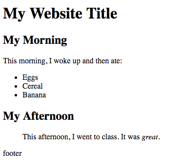

## Exercise 1: Basic HTML Syntax

This is a short exercise to practice basic HTML. As described in [module-4](https://github.com/info343c-a16/m4-git-intro), start by forking and cloning this repository. Then, follow the instructions in your `index.html` file to create a page that looks like this:  

See the `complete` branch for answers.
